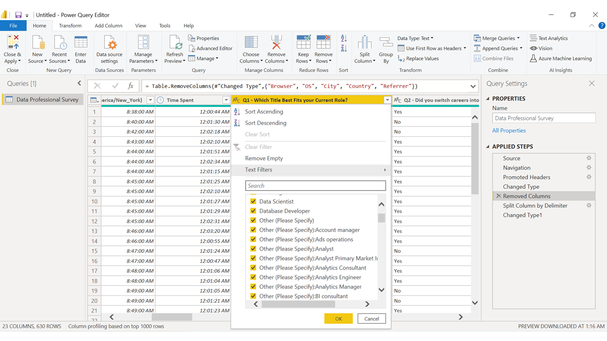
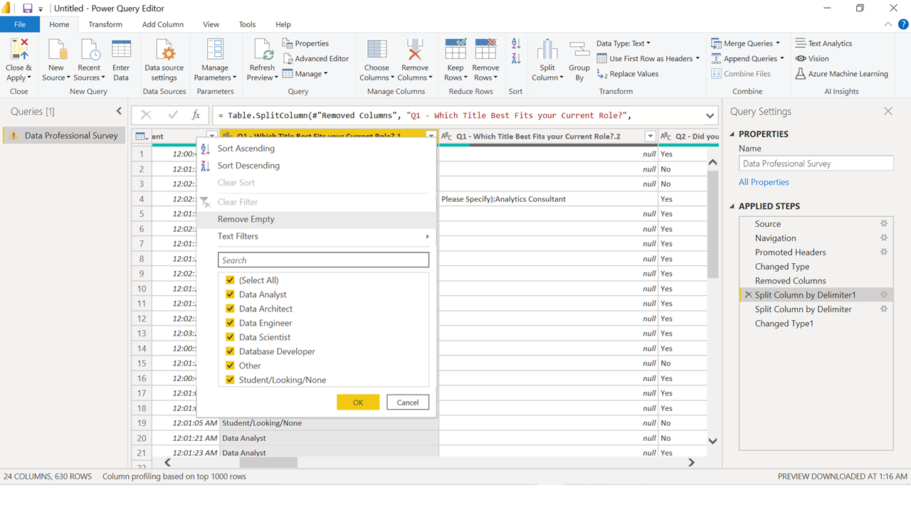
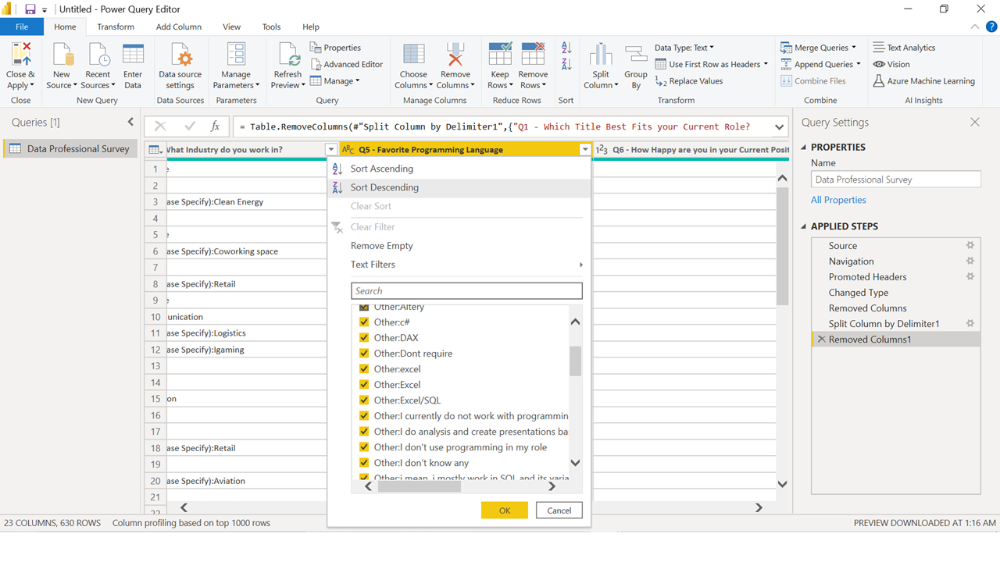
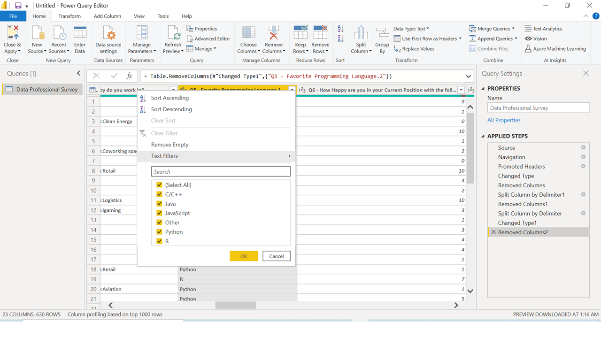
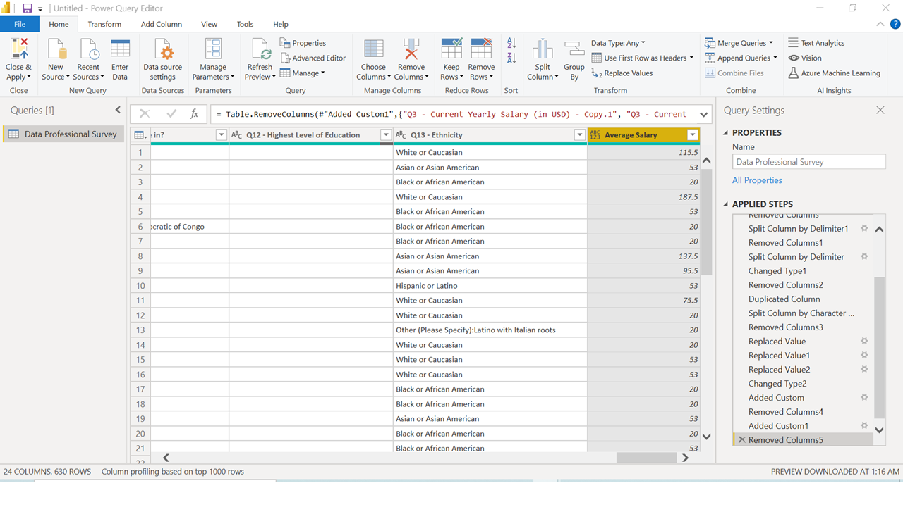

# Power_Bi_Project
This Project has been created to showcase my skills in Power Bi

## Step by Step Process

### Step 1
Start Transforming some of the data using Power Bi Transformation tool. I started by deleting columns "Browser" all the way to the "Referral" Column. 

### Step 2
For the porpuse of this project I will group all "other" options in the role/title column as one. What I did was in the transform tool iside of Power Bi, clicked on split columns by delimiter chosing "(" as the delimiter. 

Once the column is split than I deleted the extra column to get a final result that has fewer category options. Here is a view of the start vs end. 
Start

End

## Step 3
Clean column Q5 favorite programming language. For this I follow the same steps as Step 2. Here is a picture of the beginning and the end result. 

Start

End

## Step 4
Break the salary range column into 3 seperate columns and get the average of each range. 

Started by duplicating the column. 
Split column digit to non digit. 
Replace values "k" and "-" for secondary column. Transformed the "+" response to be 225.
Make both columns whole numbers
Add custom column and name it Average Salary. Create the operation of column 1 + column 2 / 2 to get the average.

## Step 5 & 6
Repeated the same process as step 3 but for the columns Country where you are from and Industry you working questions of the survey

